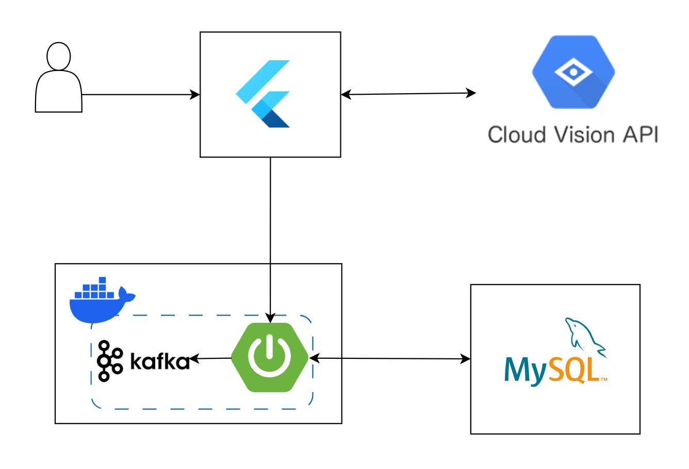

# 알뜰티콘 (SCROOGE)

충북대학교 컴퓨터공학과 25년 1학기 개신프론티어 교과목 프로젝트
 
 

## 📚 프로젝트 소개

알뜰티콘은 사용자가 소유한 기프티콘을 쉽게 관리하고, 친구 및 그룹을 통해 공유할 수 있도록 도와주는 웹 애플리케이션입니다.

- 기프티콘 정보 등록 및 관리 (OCR 활용)
- 친구 시스템을 통한 기프티콘 공유
- 그룹별 기프티콘 관리 기능
- 브랜드별 갤러리 기능 제공
- 실시간 알림 기능 (Kafka 기반)

 

## 🔖 주요 기능

### 🔐 사용자 관리
- 회원가입 / 로그인 (JWT 기반 인증)
- 선호 키워드 저장
- 친구 요청, 수락, 거절 기능

### 🎟 기프티콘 관리
- OCR 기반 이미지 인식 → 기프티콘 정보 자동 등록
- 시간 갤러리 (개인 소유 기프티콘 관리)
- 그룹 갤러리 (그룹 단위 기프티콘 공유 및 등록)
- 브랜드 갤러리 (브랜드별로 보기 쉽게 분류)
- 사용 완료 시 휴지통으로 이동 (이력 관리)

### 🔔 실시간 알림
- Kafka + WebSocket 기반 실시간 알림 전송
- 친구 요청, 그룹 초대 등 실시간 알림 제공

 

## 🏛️ 시스템 아키텍처

  

 

## ⚙️ 기술 스택

| 구분 | 내용 |
| --- | --- |
| Language | Java 17, Python (OCR 처리) |
| Backend | Spring Boot, Spring JPA, Kafka, WebSocket |
| Frontend | Flutter |
| OCR API | Google Cloud Vision API |
| Database | MySQL |
| 인증 방식 | JWT 기반 (Refresh Token 미사용) |

 

## 🎞️ 시연 영상

👉 https://youtu.be/n2gaFwPn6ns

 

## 👨‍👩‍👧‍👦 프로젝트 팀원

| 박형우 (팀장) | 송영은 | 이채운 |
| --- | --- | --- |
||||
